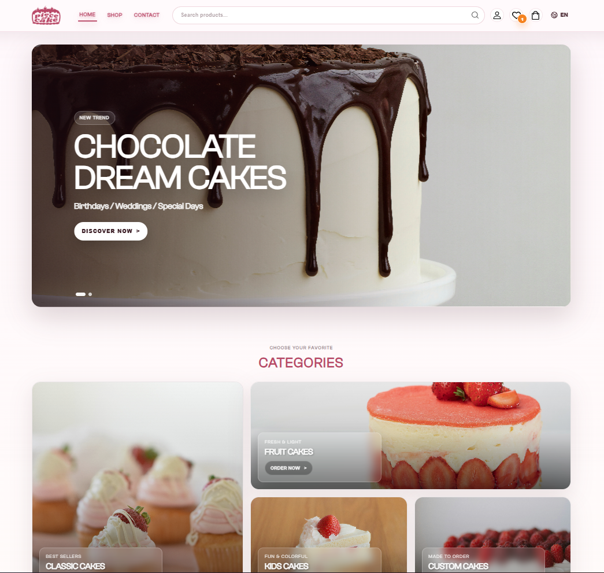
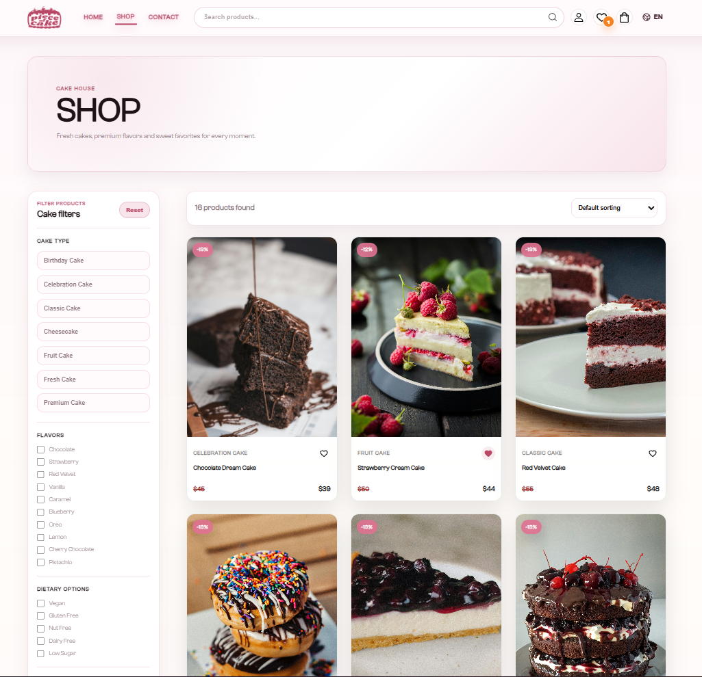
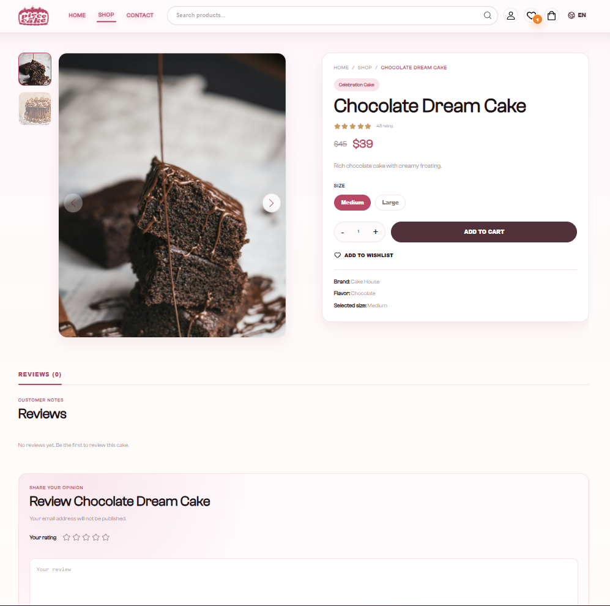
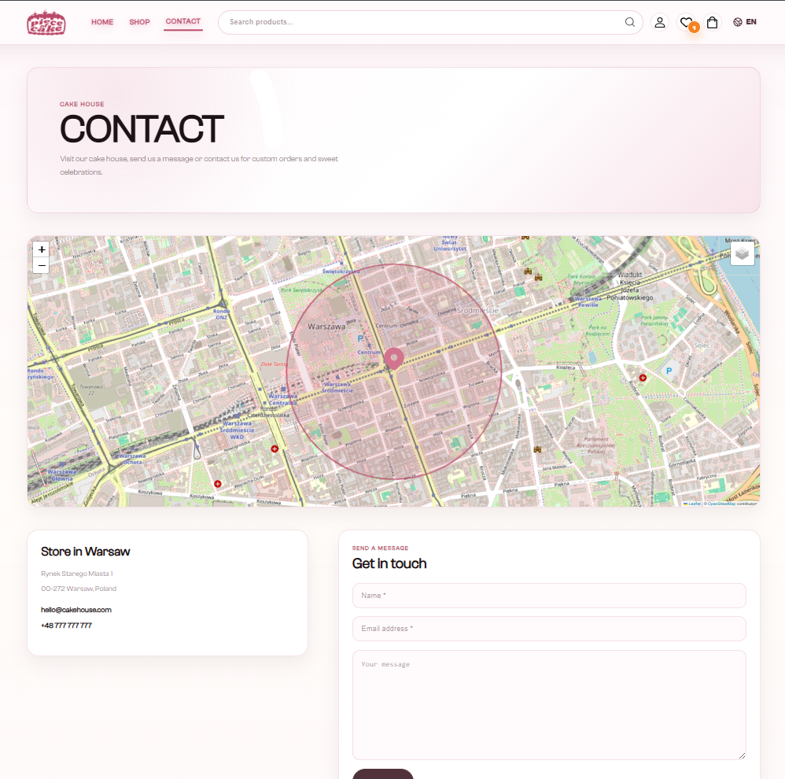
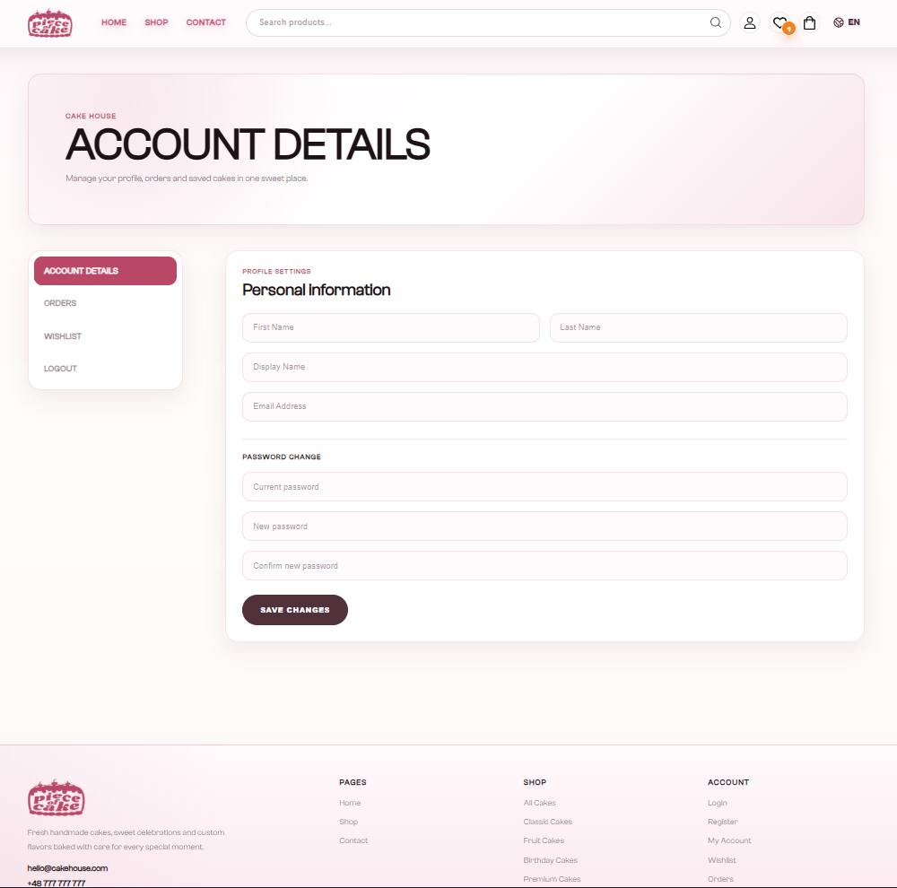
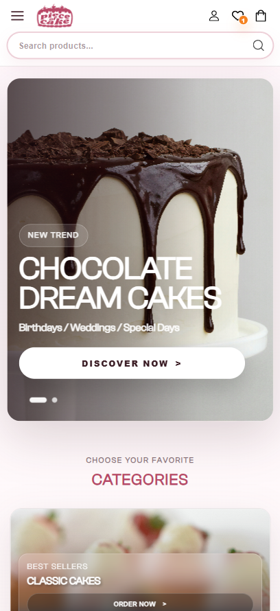
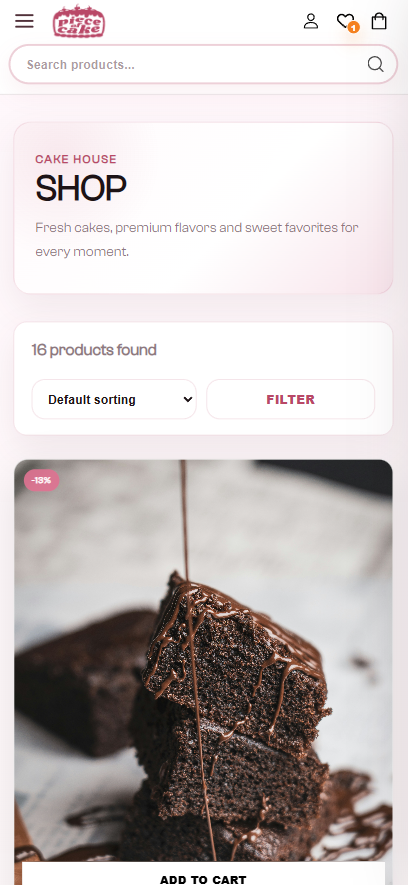
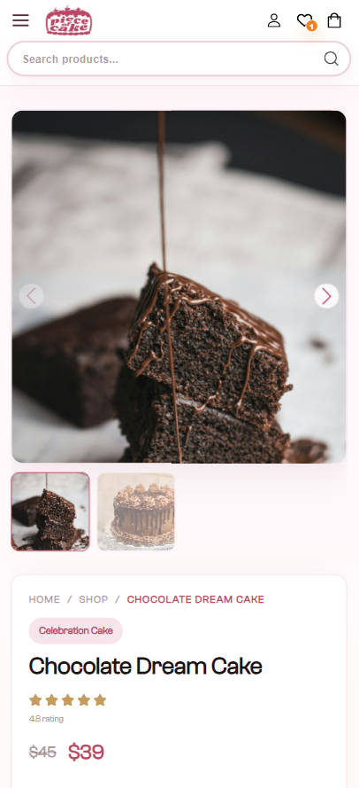
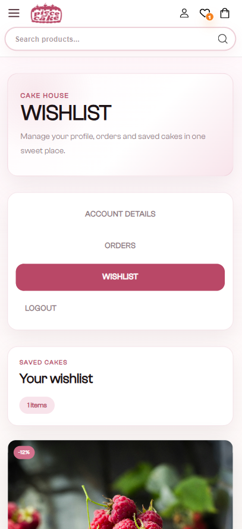

# Cake House Frontend

A modern and responsive cake shop frontend built with React, TypeScript, Vite, Redux Toolkit, SCSS Modules, and multilingual support.

Cake House is an e-commerce style bakery application where users can browse cakes, filter products, view product details, manage wishlist and cart items, complete checkout, and track orders through their account.

## Table of Contents

- [Overview](#overview)
- [Screenshots](#screenshots)
- [Features](#features)
- [Tech Stack](#tech-stack)
- [Project Structure](#project-structure)
- [Pages and Routes](#pages-and-routes)
- [Getting Started](#getting-started)
- [Environment Variables](#environment-variables)
- [Available Scripts](#available-scripts)
- [State Management](#state-management)
- [API Integration](#api-integration)
- [Internationalization](#internationalization)
- [Styling System](#styling-system)
- [Backend Requirements](#backend-requirements)
- [Git Notes](#git-notes)
- [Author](#author)

## Overview

Cake House is a frontend application for a cake shop platform. The project focuses on a clean shopping experience, responsive layouts, reusable components, and real API integration.

The application includes a multilingual interface and supports product data returned from the backend according to the selected language.

## Screenshots


### Desktop Views

#### Home Page



#### Shop Page



#### Product Detail Page



#### Contact Page



#### Account Page



### Mobile Responsive Views

<p>
  
  
  
</p>

<p>
  
</p>

## Features

### Storefront

- Responsive home page
- Main hero slider
- Category section
- Trendy products section
- Spring collection section
- Limited edition products slider
- Footer with useful page links

### Shop

- Product listing page
- Product search
- Category filters
- Flavor filters
- Dietary option filters
- Size filters
- Price range filter
- Sorting options
- Pagination
- Empty state handling
- Responsive filter drawer for smaller screens

### Product Detail

- Product image slider
- Product information section
- Price and discount display
- Size selection
- Quantity selection
- Add to cart
- Add/remove wishlist
- Product reviews
- Related products slider
- Error handling for missing products

### Cart and Checkout

- Header cart drawer
- Full cart page
- Quantity increase/decrease
- Remove cart item
- Cart totals
- Checkout steps
- Billing form validation
- Payment method selection
- Order creation
- Confirmation page
- Order details summary

### Account

- Register page
- Login page
- Lost password page
- Account details page
- Wishlist page
- Orders page
- Active account sidebar links

### Localization

- English language support
- Azerbaijani language support
- Polish language support
- Localized routes
- Translated static UI text
- Backend-driven translated product content

## Tech Stack

| Technology | Purpose |
| --- | --- |
| React | UI development |
| TypeScript | Type safety |
| Vite | Development and build tool |
| Redux Toolkit | Global state management |
| React Redux | React bindings for Redux |
| React Router DOM | Client-side routing |
| Axios | API requests |
| SCSS Modules | Component-level styling |
| react-i18next | Internationalization |
| Swiper | Sliders and carousels |
| Leaflet / React Leaflet | Contact map |
| Lucide React | Icons |
| ESLint | Code linting |

## Project Structure

```text
src/
  api/
    auth/
    cart/
    order/
    product/
    wishlist/

  assets/
    components/
      accountLayout/
      checkoutSteps/
      languageSwitcher/
      layout/
      pageLoader/
      productCard/
    fonts/
    images/

  helpers/
    apiError.ts
    languagePath.ts
    storage.ts

  i18n/
    locales/
      az/
      en/
      pl/
    index.ts

  pages/
    account/
    auth/
    cart/
    checkout/
    confirmation/
    contact/
    error/
    home/
    shop/

  routes/
  store/
  styles/
  types/
```

## Pages and Routes

| Page | Route |
| --- | --- |
| Home | `/` |
| Shop | `/products` |
| Product Detail | `/products/:id` |
| Cart | `/cart` |
| Checkout | `/checkout` |
| Confirmation | `/confirmation` |
| Contact | `/contact` |
| Login | `/auth/login` |
| Register | `/auth/register` |
| Lost Password | `/auth/lost-password` |
| Account Details | `/account/details` |
| Wishlist | `/account/wishlist` |
| Orders | `/account/orders` |
| Error | `/error` |

Localized routes are also supported:

```text
/en/products
/az/products
/pl/products
```

## Getting Started

### 1. Clone the repository

```bash
git clone https://github.com/Nihad-memmedzade/Cake_House.git
```

### 2. Go to the project folder

```bash
cd Cake_House
```

### 3. Install dependencies

```bash
npm install
```


### 4. Run the development server

```bash
npm run dev
```

The app will usually run at:

```text
http://localhost:5173
```

## Available Scripts

```bash
npm run dev
```

Starts the development server.

```bash
npm run build
```

Runs TypeScript checks and creates a production build.

```bash
npm run lint
```

Runs ESLint checks.

```bash
npm run preview
```

Previews the production build locally.

## State Management

Redux Toolkit is used for application state.

```text
store/
  authSlice.ts
  cartSlice.ts
  orderSlice.ts
  productSlice.ts
  wishlistSlice.ts
  store.ts
```

### Slices

| Slice | Responsibility |
| --- | --- |
| `authSlice` | Login, register, logout, current user state |
| `productSlice` | Products, filters, details, reviews, related products |
| `wishlistSlice` | Wishlist logic for guest and authenticated users |
| `cartSlice` | Cart logic for guest and authenticated users |
| `orderSlice` | Order creation, last order, and order history |

Guest cart and wishlist data can be stored locally. Authenticated cart, wishlist, and orders are synchronized with the backend.

## API Integration

API requests are organized inside `src/api`.

```text
api/
  auth/
  cart/
  order/
  product/
  wishlist/
```

Axios is configured in `src/api/index.ts`.

The API layer uses:

- `VITE_API_URL` as base URL
- JSON request headers
- access token from `localStorage`
- active language for translated product data

Product requests send the selected language to the backend so product titles, categories, flavors, and descriptions can be returned in the correct language.

## Internationalization

The project uses `react-i18next`.

Translation files are located in:

```text
src/i18n/locales/en/translations.json
src/i18n/locales/az/translations.json
src/i18n/locales/pl/translations.json
```

Supported languages:

- English
- Azerbaijani
- Polish

The selected language is saved in `localStorage` and reflected in the route prefix.

Example localized paths:

```text
/en
/az/products
/pl/account/orders
```

## Styling System

The project uses SCSS Modules with shared utility files.

```text
src/styles/utils/_variables.module.scss
src/styles/utils/_maps.module.scss
src/styles/utils/_mixin.module.scss
```

These files include reusable values and helpers for:

- brand colors
- text colors
- shadows
- border radius values
- breakpoints
- typography
- layout containers
- flex helpers
- responsive mixins
- reusable button and UI patterns

Most page and component styles are colocated with their related component.


## Author

Developed by Nihad Mammadzada.
